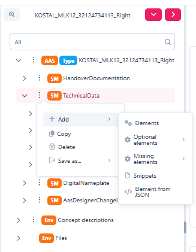
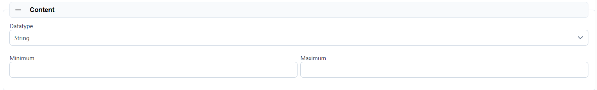
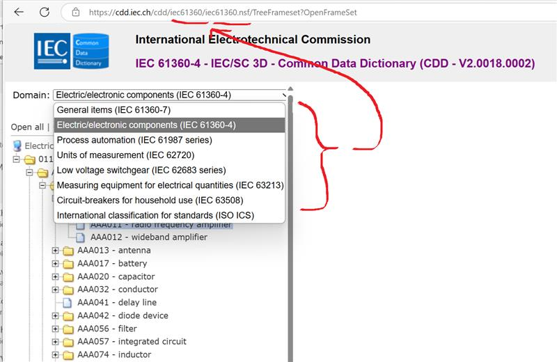
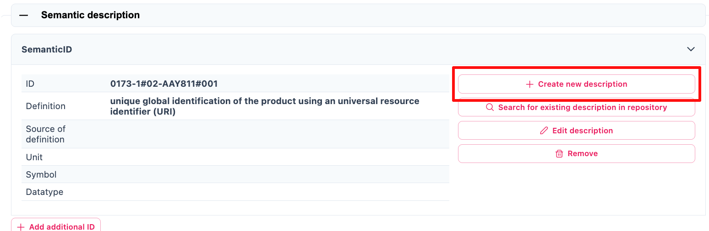

____
*AAS - Designer Manual*
____

*_TP 12 – „Produktkatalog“_*

* +
*

== Table of Contents

link:#_Toc193102659[Table of Contents link:#_Toc193102659[2]]

link:#getting-started-with-aas-designer[1 Getting Started with AAS Designer link:#getting-started-with-aas-designer[4]]

link:#login[1.1 Login link:#login[4]]

link:#user-registration[1.2 User registration link:#user-registration[5]]

link:#version-information[1.3 Version Information link:#version-information[6]]

link:#aas-designer-overview[2 AAS-Designer Overview link:#aas-designer-overview[8]]

link:#aas-server-selection[3 AAS Server Selection link:#aas-server-selection[9]]

link:#for-admin-users[3.1 For Admin Users link:#for-admin-users[9]]

link:#for-users-with-lower-privileges[3.2 For Users with Lower Privileges link:#for-users-with-lower-privileges[10]]

link:#operating-the-tree-structure[4 Operating the Tree Structure link:#operating-the-tree-structure[11]]

link:#inserting-elements[4.1 Inserting elements link:#inserting-elements[13]]

link:#_Toc193098548[a. Operating the Elements in AAS link:#_Toc193098548[14]]

link:#property[4.2 Property link:#property[16]]

link:#details[4.2.1 “Details” link:#details[18]]

link:#content[4.2.2 “Content” link:#content[18]]

link:#semantic-description[4.2.3 “Semantic Description” link:#semantic-description[18]]

link:#qualifier[4.2.4 “Qualifier” link:#qualifier[19]]

link:#data-definition[4.2.5 “Data Definition” link:#data-definition[19]]

link:#range[4.3 Range link:#range[22]]

link:#content-1[4.3.1 “Content” link:#content-1[22]]

link:#submodelelementlist[4.4 SubmodelElementList link:#submodelelementlist[22]]

link:#details-1[4.4.1 “Details” link:#details-1[23]]

link:#semantic-description-1[4.4.2 “Semantic Description” link:#semantic-description-1[23]]

link:#qualifier-1[4.4.3 “Qualifier” link:#qualifier-1[24]]

link:#data-definition-1[4.4.4 “Data Definition” link:#data-definition-1[24]]

link:#submodelelementcollection[4.5 SubmodelElementCollection link:#submodelelementcollection[25]]

link:#details-2[4.5.1 “Details” link:#details-2[25]]

link:#semantic-description-2[4.5.2 “Semantic Description” link:#semantic-description-2[26]]

link:#qualifier-2[4.5.3 “Qualifier” link:#qualifier-2[26]]

link:#_Toc193098566[• Custom Qualifiers link:#_Toc193098566[27]]

link:#_Toc193098567[• Cardinality link:#_Toc193098567[27]]

link:#data-definition-2[4.5.4 “Data Definition” link:#data-definition-2[27]]

link:#overview-of-aas-shells[5 Overview of AAS Shells link:#overview-of-aas-shells[29]]

link:#view[5.1 View link:#view[30]]

link:#modify[5.2 Modify link:#modify[31]]

link:#delete[5.3 Delete link:#delete[32]]

link:#advanced[5.4 Advanced link:#advanced[33]]

link:#create-feed-mapping[5.4.1 Create Feed Mapping link:#create-feed-mapping[33]]

link:#duplicate[5.4.2 Duplicate link:#duplicate[33]]

link:#exports[5.5 Exports link:#exports[34]]

link:#create-link-for-sharing[5.6 Create Link for Sharing link:#create-link-for-sharing[34]]

link:#aas-designer-features[6 AAS-Designer Features link:#aas-designer-features[36]]

link:#dashboard[6.1 Dashboard link:#dashboard[36]]

link:#packages[6.2 Packages link:#packages[36]]

link:#create-aas[6.3 Create AAS link:#create-aas[37]]

link:#idta-submodels[6.4 IDTA Submodels link:#idta-submodels[38]]

link:#my-area[6.5 My Area link:#my-area[39]]

link:#feed-mapping[6.6 Feed Mapping link:#feed-mapping[39]]

link:#identification-schemas-and-their-importance[7 Identification Schemas and their Importance link:#identification-schemas-and-their-importance[41]]

link:#uuidguid[7.1 UUID/GUID link:#uuidguid[41]]

link:#irdi-iso-29005-5[7.2 IRDI (ISO 29005-5) link:#irdi-iso-29005-5[42]]

link:#understand-the-iec-irdi-structure[7.2.1 Understand the IEC IRDI Structure link:#understand-the-iec-irdi-structure[43]]

link:#understand-the-eclass-irdi-structure[7.2.2 Understand the ECLASS IRDI Structure link:#understand-the-eclass-irdi-structure[43]]

link:#uriiri[7.3 URI/IRI link:#uriiri[45]]

link:#semantic-databases[8 Semantic Databases link:#semantic-databases[46]]

link:#iec-cdd[8.1.1 IEC-CDD link:#iec-cdd[47]]

link:#eclass[8.1.2 ECLASS link:#eclass[50]]

link:#vec[8.1.3 VEC link:#vec[51]]

link:#add-semantic-references-to-the-entities-of-aas-shell[9 Add Semantic References to the Entities of AAS Shell link:#add-semantic-references-to-the-entities-of-aas-shell[55]]

link:#submodel[9.1 Submodel link:#submodel[55]]

link:#property-value[9.2 Property Value link:#property-value[56]]

link:#concept-description[10 Concept Description link:#concept-description[58]]

link:#_Toc193102721[11 Literaturverzeichnis link:#_Toc193102721[59]]

link:#list-of-figures[12 List of Figures link:#list-of-figures[63]]

== *Getting Started with AAS Designer*

Follow the following steps to get started with AAS Designer.

*Step 1*: Visit http://www.google.com/[www.google.com] and type AAS Suite. Click on the first option.

.[#_Toc193976710 .anchor]####Abbildung 1‑1: Accessing AAS Designer via Google Search

*Step 2*: To proceed, scroll down the website until you find the link highlighted in the image below. Once you locate it, click the button.

.[#_Toc193976711 .anchor]####Abbildung 1‑2: Navigating to the AAS Suite Designer

=== Login

*Step 3*: After clicking the link, you will be redirected to the login page. Once logged in, you will be taken to the AAS Suite Dashboard. On the Login Page, you can click on "Show T&C" to view the General Terms and Conditions of AAS Suite provided by Meta-Level Software AG, along with relevant pricing details.

.[#_Toc193976712 .anchor]####Abbildung 1‑3: Logging into the AAS Suite Designer

.[#_Toc193976713 .anchor]####Abbildung 1‑4: Screenshot of Pricing and Terms in AAS Suite

=== User registration

If you're not already registered, you can click on "Request Registration". This will redirect you to the registration page, where you can fill out the registration form to create your account and gain access to the AAS Suite. Once registered, you can log in and proceed with using the platform as needed.

.[#_Toc193976714 .anchor]####Abbildung 1‑5: Registration Page for AAS Suite

=== Version Information

To view the version number, click on the highlighted profile section at the top right of the page.

.[#_Toc193976715 .anchor]####Abbildung 1‑6: Accessing AAS Suite Version Details

You can see that the version number of the software displayed above is 8. This indicates the current version of the AAS Suite you're using.

.[#_Toc193976716 .anchor]####Abbildung 1‑7: AAS Suite Version Information

By clicking on License Info, you can access additional details such as the License Name, Copyright Information, and the Validity period of your current license.

.[#_Toc193976717 .anchor]####Abbildung 1‑8: AAS Suite License Information

== *AAS-Designer Overview*

The https://aas-suite.com/en[AAS Suite] is a comprehensive platform designed to simplify the creation, validation, and sharing of Asset Administration Shells (AAS) in Industry 4.0 environments. It includes multiple tools such as the https://designer.aas-suite.com/[AAS Designer], which enables users to create, edit, and validate AAS with ease, and the https://market.aas-suite.com/[AAS Marketplace], where AAS can be shared and accessed. Additional tools like the Viewer, Reader, Feed Application, and https://compare.aas-suite.com/[Compare Tool] further enhance AAS management and usability.

The AAS Designer is a user-friendly tool that caters to both beginners and experts. It provides step-by-step guidance for creating administration shells with essential submodels, such as the digital nameplate and handover documentation, while also offering an expert mode for advanced users to efficiently create, validate, and edit AAS. Users can collaborate with their company by sharing AAS through the Designer or publish them on the AAS Marketplace. Also, AAS can be deployed and instantiated into an AAS registry or repository system directly from the Designer. The AAS Designer addresses this challenge by offering automated assistance, a guided workflow, and an expert mode for advanced users, ensuring error-free AAS creation.

.[#_Toc193976718 .anchor]####Abbildung 2‑1: Overview of https://aas-suite.com/en[AAS Suite] Platform

The https://designer.aas-suite.com/[AAS Designer] consists of several key components: _Dashboard_, _Shells_, _Create_, _IDTA Submodels_, _My Area_, and _Feed Mapping_. Each of these plays a role in the creation and management of Asset Administration Shells. We will explore these components in detail in the upcoming chapters.

.[#_Toc193976719 .anchor]####Abbildung 2‑2: Shells in AAS-Designer
image::extracted-media/media/image14.png[A screenshot of a computer Description automatically generated,width=604,height=182]

== *AAS Server Selection*

As shown in Figure 1, the top right side displays a selection list of servers, such as _Internal Infrastructure_ and https://v3.admin-shell-io.com/. These are the servers accessible by the AAS-Designer. By selecting one, the list of corresponding shells become available for access.

.[#_Toc193976720 .anchor]####Abbildung 3‑1: List of shells in other servers

The AAS-Designer’s _Internal Infrastructure_ server has its own configurable settings. It provides role-based privileges, ensuring that access is granted according to user roles.

=== For Admin Users

If you are an Admin, follow these steps to view or modify the server configuration:

[arabic]
. Navigate to *"My Area"* and click on the organization**.**
. You will see a list of servers along with their status (*Active/Inactive*), as well as their corresponding registries and repositories.

Refer the figure below for a visual representation.

.[#_Toc193976721 .anchor]####Abbildung 3‑2: Server Configuration for Admin

=== For Users with Lower Privileges

If you have a lower authority role and lack the necessary permissions, you will not be able to view the server information, as shown in below figure.

.[#_Toc193976722 .anchor]####Abbildung 3‑3: Server Configuration for Lower Authority Role

== *Operating the Tree Structure*

Lets try to understand tree structure of the shell. To view the tree structure of the shell, you need to get into the shell. Follow the following steps to get into/ modify the shell.

.[#_Toc193976723 .anchor]####Abbildung 4‑1: Overview of Shells

To modify a shell, follow these steps:

[arabic]
. In the Shells Overview, click on the three-dot menu on the left side of the shell.
. Select "Modify" from the dropdown menu.
. You will now see the dashboard of the selected shell.

On the left side of the dashboard, you will find the tree structure, which consists of:

* Submodels
* Files
* Concept Descriptions

You can add, modify, or remove any submodel within this tree structure at any time. Refer to the figure below for a visual representation of the tree structure.

.[#_Toc193976724 .anchor]####Abbildung 4‑2:Understanding Tree Structure in AAS Designer

As you click on the arrow to the left of any submodel, such as HandoverDocumentation, a nested structure will expand beneath it. This reveals additional elements contained within the submodel. Referring to the figure below, you will see the corresponding properties of the submodel. These properties can be modified as needed, allowing you to update existing values or add new properties to the submodel.

.[#_Toc193976725 .anchor]####Abbildung 4‑3: Expanding the Tree Structure in AAS Designer

The AAS Shell of a component follows a structured tree hierarchy, which can be modified by the user based on the available information. For example, in the figure above, https://produktkatalog.kostal-kontakt-systeme.com/web/kostal/de/KOSTAL/1544168152667/Steckh%C3%BClsengeh%C3%A4use/PR/10019158/index.xhtml?ds=Web_intern[KOSTAL++_++PLK14++_++10019158] represents a component whose AAS needs to be identified. Under this component, there are multiple submodels, such as HandoverDocumentation ++[++1++]++, TechnicalData ++[++2++]++, DigitalNameplate ++[++3++]++ MCAD, and AasDesignerChangelog.

Within every tree structure, you will find two common elements: Concept Description and Files. The AAS can define its own dictionary, which contains semantic definitions of its submodel elements. These semantic definitions are known as Concept Descriptions (ConceptDescription). The Files section contains all documents and files uploaded to the AAS Shell of the component, ensuring that relevant information is easily accessible and well-organized.

The AAS Designer presents a tree structure that visually organizes different components of an Asset Administration Shell (AAS). This hierarchical representation includes elements such as Submodels, Properties, Property Values, and Concept Descriptions.

=== Inserting elements

For example, in the AAS Designer’s directory tree, you may encounter elements like:

[#_Toc193976726 .anchor]####Abbildung 4‑4: Inserting Elements in the AAS Designer

* Submodels (SM): HandoverDocumentation ++[++1++]++, TechnicalData ++[++2++]++, DigitalNameplate ++[++3++]++, MCAD, etc.
* Submodel Element Collections (SMC)
* Properties (Prop): specification, data++_++sheet
* Property Value: It is a reference to the global ID of a coded value. It is unique in nature. Concept Descriptions (CD) are supported, allowing the generation of semantic references that define standardized meanings for properties.
* The value of Property/value must match the referenced coded value in Property/valueId if both a Property/value and a Property/valueId exist.

[loweralpha]
. [#_Toc193098548 .anchor]##*Operating the Elements in AAS*

As previously mentioned, there are various types of elements available and selectable based on our requirements in AAS Designer.

This chapter provides definitions for the most important elements in AAS.

* Property: A property is a data element that possesses a single value. (For example, properties with specific values such as WireDiameter.)
* Range: A range data element defines a range with a minimum and maximum value. (For example, TemperatureRange.)
* SubmodelElementList: A submodel element list is an ordered list of submodel elements. (TechnicalData, DigitalNameplate.)
* SubmodelElementCollection: A relationship element is utilized to establish a connection between two elements, which can be either referable (model reference) or external (external reference).

To insert a new element, click on the three-dot menu on the left side of the SubModel. From the dropdown menu that appears, select the "Add" option. Then select in the following dropdown menu “Elements”. You will then see a list of all available elements, such as range, property, and more. Now you can choose one element and it will be added to the tree hierarchy. 

.[#_Toc193976727 .anchor]####Abbildung 4‑5: three dot menu in the pre hierarchy

[#_Toc193976728 .anchor]####Abbildung 4‑6: Adding new elements

.[#_Toc193976729 .anchor]####Abbildung 4‑7:Options of Elements

[#_Toc193976730 .anchor]####Abbildung 4‑8: Adding new Element

=== Property

A property can be in detail defined with semantic reference, unit definition and other value specific definitions (i.e. tolerance range) via Concept Description (CD), Embedded Data Definition (EDD) and Qualifiers.

CD is used to provide a standardized semantic reference for a property, ensuring clarity and interoperability across different systems. It defines the meaning and context of the property within an asset administration shell.

EDD specifies additional characteristics of a property, such as data type, value range, or constraints. It is useful when an external reference is not available or needed for defining detailed attributes.

Qualifiers provide contextual information about a property, such as accuracy, validity period, or measurement conditions. They help refine the meaning and usage of a property without altering its core definition.

As an example in this document, the following JSON example shall be modelled accordingly in the AAS-Designer:

++{++

"idShort": "overallLength",

"description": ++[++

++{++

"language": "en",

"text": "Specifies the overall length of the terminal (see diagram ++\\\++"Terminal Dimensions++\\\++"). Specifies the value of the numerical value and the tolerance range. ++\\++nThe values of the limits of the tolerance, lowerBoundary and upperBoundary, shall be interpreted as ++\\\++"modifiers++\\\++" to the actual value. To obtain an absolute range of valid values, the values of boundaries shall be added to the actual value, regardless of the Upper or Lower prefix. For example, to define a value of 100mm with a tolerated variation between 14.7mm and 15.3mm, the definition would be Value = 15 mm, LowerBoundary=-0.3, UpperBoundary={plus}0.3. The Unit of the tolerance boundaries shall always the same as in the defining context."

}

++]++,

"qualifiers": ++[++

++{++

"kind": "ConceptQualifier",

"type": "lowerBoundary",

"valueType": "xs:double",

"value": "-0.3"

},

++{++

"kind": "ConceptQualifier",

"type": "lowerBoundary",

"valueType": "xs:double",

"value": "{plus}0.3"

}

++]++,

"embeddedDataSpecifications": ++[++

++{++

"dataSpecificationContent": ++{++

"preferredName": ++[++

++{++

"language": "en",

"text": "millimeter"

}

++]++,

"shortName": ++[++

++{++

"language": "en",

"text": "mm"

}

++]++,

"unit": "Millimetre",

"unitId": ++{++

"type": "ExternalReference",

"referredSemanticId": ++{++

"type": "ExternalReference",

"keys": ++[++

++{++

"type": "GlobalReference",

"value": "https://cdd.iec.ch/cdd/iec62720/iec62720.nsf/Units/0112-2---62720%23UAB072"

}

++]++

},

"keys": ++[++

++{++

"type": "GlobalReference",

"value": "0112/2///62720#UAA862"

}

++]++

},

"sourceOfDefinition": "https://qudt.org/2.1/vocab/unit#MilliM",

"symbol": "mm",

"dataType": "REAL++_++MEASURE",

"definition": ++[++

++{++

"language": "",

"text": "SI base unit ampere divided by the 0.001-fold of the SI base unit metre"

}

++]++,

"modelType": "DataSpecificationIec61360"

},

"dataSpecification": ++{++

"type": "ExternalReference",

"keys": ++[++

++{++

"type": "GlobalReference",

"value": "http://admin-shell.io/DataSpecificationTemplates/DataSpecificationIEC61360/3/0"

}

++]++

}

}

++]++,

"valueType": "xs:double",

"value": "15",

"modelType": "Property"

}

==== “Details” 

The Property definition begins in the “Details” section, where the name of the property is assigned in the _idShort_. In addition, a language-dependent short _description_ and a _display name_ of the respective property can be described. If present, please make sure that at least an english version is present. In the datatype section, NULL or CONSTANT is usually specified for type definitions.

.[#_Toc193976731 .anchor]####Abbildung 4‑9: Details

==== “Content” 

In the “Content” section a nominal value can be assigned. If available, _valueId_ can be filled in with a semantic reference to a value definition (typically a IRDI or IRI).

==== “Semantic Description” 

Next up the Semantic description can be added. It must be noted that this lead to the creation of a so called “Concept Description” (CD), which is a stand-alone element and can be referenced by other property definitions as well.

.[#_Toc193976732 .anchor]####Abbildung 4‑10: Semantic Description

This contrasts with the “Qualifiers” and “Data Definitions”, which are directly embedded in the property definition.

==== “Qualifier” 

Additional definitions for a property can be done via the “Qualifier” concept, i.e. definition of Upper- and Lower-Boundaries as shown below:

.[#_Toc193976733 .anchor]####Abbildung 4‑11: Qualifier

Qualifiers in the Asset Administration Shell (AAS) provide additional metadata about elements, acting as type-value pairs that define properties related to value, semantics, or existence. There are three main types: *ValueQualifier*, which describes how a value was determined (e.g., "measured" or "substitute value" for temperature); *ConceptQualifier*, which differentiates semantically similar elements based on lifecycle stages (e.g., "as planned" vs. "as maintained" for a Bill of Material); and *TemplateQualifier*, which defines whether a submodel element is "mandatory" or "optional." Constraints ensure consistency, such as AASd-006, which requires a qualifier’s _value_ and _valueId_ to be identical if both are present, and AASd-020, which enforces data type consistency. In terms of referencing, AAS elements can be *identifiable* (globally unique ID), *referable* (having an _idShort_ within a namespace), or *neither* (such as qualifiers, which are attributes). A referable element's namespace is determined by its parent, ensuring structured relationships, such as a submodel serving as the namespace for its contained properties.

Definitions from the AASXPE can be found here: https://github.com/admin-shell-io/aasx-package-explorer/blob/main/src/AasxPackageExplorer/qualifier-presets.json

==== “Data Definition”

The embedded data definition uses exactly the same IEC61360 data structure as used for Concept Descriptions and was initially designed to describe an IEC-CDD reference. But it can also be used for referencing other systems or definition purposes, such as to to define a range of preset values (enums).

A typical usage would be for an embedded unit definition can be done as shown below.

.[#_Toc193976734 .anchor]####Abbildung 4‑12: Data Definition

The embedded data definition uses exactly the same IEC61360 data structure as used for Concept Descriptions and was initially designed to describe an IEC-CDD reference. But it can also be used for referencing other systems or definition purposes, such as to define a range of preset values (enums).

A typical usage would be for an embedded unit definition can be done as shown below.

.[#_Toc193976735 .anchor]####Abbildung 4‑13: Embedded Unit Definition

In the beginning of the Data definition you can choose the Type between ModelReference and ExternalReference. A ReferenceID can be included in the following. In the Data definition you can assign a Preference name in different languages. You can give the definition a name in the “Preferred Name” Section. To shorten it up you can give the Preferred Name in “Short Name”. In the Definition Section you can describe it in a short sentence. To give a reference for the definition in “Source of Definiton”. The most important feature in the Data definition is the Value List. In the Value List you can Insert a List of entities pertaining to the selected element.

.[#_Toc193976736 .anchor]####Abbildung 4‑14: External Reference in Definition

=== Range

In the following all the important definitions will be explained which are necessary for a Range. The only difference compared to Property is the area of Content. Therefor in the next subchapter only the “Content” part is explained.

==== “Content”

In the “Content” part you can now select Datatype from a dropdown List, which will open up when you click on the bar at the Datatype. You can also define an Range from Minimum and Maximum.

.[#_Toc193976737 .anchor]####Abbildung 4‑15: Content part of Range

=== SubmodelElementList

This section will explain how to insert a SubmodelElementList and which features it contains. A SubmodelElementList is a structural element in the Asset Administration Shell (AAS) that organizes multiple submodel elements in a structured and ordered manner. It is particularly useful for handling sets, lists, arrays, and ordered collections of elements with the same semantic meaning.

Unlike a SubmodelElementCollection, which allows heterogeneous elements, a SubmodelElementList enforces semantic and type consistency among its elements.

Common use cases include:

* Representing multi-dimensional arrays (e.g., a 2D table of values).
* Storing repeated elements that follow a predefined format (e.g., lists of technical specifications).
* Grouping structured information, such as a series of sensor readings over time​.

==== “Details”

The Property definition begins in the “Details” section, where the name of the SubmodelElementList is assigned in the _idShort_. In addition, a language-dependent short _description_ and a _display name_ of the respective property can be described. If present, please make sure that at least an english version is present. “Order Relevant” indicates whether the order of elements in the list is semantically relevant.

.[#_Toc193976738 .anchor]####Abbildung 4‑16: Details of submodelElementList

==== “Semantic Description”

A SubmodelElementList is defined semantically using Concept Descriptions (CDs). This ensures:

* Interoperability across different AAS implementations.
* Reusability in multiple property definitions.
* Consistency in data modeling.

It must be noted that this leads to the creation of a so called “Concept Description” (CD), which is a stand-alone element and can be referenced by other property definitions as well.

.[#_Toc193976739 .anchor]####Abbildung 4‑17: Semantic ID

This is in contrast to the “Qualifiers” and “Data Definitions”, which are directly embedded in the property definition.

==== “Qualifier” 

Additional definitions for a property can be done via the “Qualifier” concept, i.e. definition of Upper- and Lower-Boundary as shown below:

.[#_Toc193976740 .anchor]####Abbildung 4‑18: Upper and Lower Boundary of Qualifiers

Json code…

==== “Data Definition”

The embedded data definition uses exactly the same IEC61360 data structure as used for Concept Descriptions and was initially designed to describe an IEC-CDD reference. But it can also be used for referencing other systems or definition purposes, such as to define a range of preset values (enums).

A typical usage would be for an embedded unit definition can be done as shown below.

.[#_Toc193976741 .anchor]####Abbildung 4‑19: Model Reference in Data Definition

=== SubmodelElementCollection

In the following all the important definitions will be explained which are necessary for a SubmodellElementCollection. A SubmodelElementCollection (SMC) is a structural element used within the Asset Administration Shell (AAS) to organize and manage multiple related SubmodelElements. Unlike a SubmodelElementList, which primarily deals with ordered and homogeneous elements, a SubmodelElementCollection serves as a container for heterogeneous elements with a predefined semantic structure. It is particularly useful when defining complex assets that consist of multiple distinct properties grouped under a common semantic meaning. Each property within the collection should have a clearly defined semantic representation, referenced by its semanticId​.

For example, a document may have properties such as _title_, _version_, _author_, and _date_, all of which belong together. A single document is therefore represented as a SubmodelElementCollection. If there are multiple documents, they may be stored in a SubmodelElementList containing multiple SubmodelElementCollections​.

A SubModellCollection is used for a kind of structure which includes the connection of multiple named values. The elements which you can fill in in the SubmodellElementCollection are the same as explained in the Property Topic. The only different is the Content part. In the Content Part you will See a listing of the Values which are created in the SubModelList. In the following picture is an example for how the listing will be look like. It allows for organizing related elements into a logical collection while maintaining their individual properties and semantics.

.[#_Toc193976742 .anchor]####Abbildung 4‑20: Example of a listing in the Content part

==== “Details”

This section defines basic attributes of a SubmodelElementCollection, ensuring its unique identification and metadata enrichment.

*•* idShort**:** The unique short identifier of the collection.

*•* Description**:** A textual representation of the purpose and contents of the collection.

*•* Display Name**:** A user-friendly name for the collection.

*•* Category**:** Defines whether the collection represents static parameters or runtime variables**​.**

.[#_Toc193976743 .anchor]####Abbildung 4‑21: Details of SubmodelElementCollection
image::extracted-media/media/image36.png[A white and blue background Description automatically generated with medium confidence,width=604,height=137]

==== “Semantic Description”

Each SubmodelElementCollection must have a ConceptDescription, providing a standardized semantic reference.

.[#_Toc193976744 .anchor]####Abbildung 4‑22: Semantic Description of SubmodelElementCollection

• Semantic ID: A globally unique identifier defining the semantic meaning of the collection.

• Definition: Explains the purpose and scope of the collection.

• Source of Definition: Indicates where the definition originates (e.g., IEC standards, IDTA, industry standards).

• Unit & Symbol**:** Υsed when the collection contains measurable numerical properties**.**

*•* Datatype**:** Specifies the data structure used within the collection.

==== “Qualifier” 

Qualifiers allow additional contextual constraints and metadata for elements within a SubmodelElementCollection.

.[#_Toc193976745 .anchor]####Abbildung 4‑23: Custom Qualifier of SubmodelElementCollection

* [#_Toc193098566 .anchor]####Custom Qualifiers

[loweralpha, start=2]
. Type: Defines the specific context of the qualifier.
. Datatype: Specifies the expected format of the qualifier value.
. Value: Represents the actual qualifier value.

.[#_Toc193976746 .anchor]####Abbildung 4‑24: Cardinality Qualifier of SubmodelElementCollection

* [#_Toc193098567 .anchor]####Cardinality

[loweralpha]
. Type: Specifies how many elements the collection can contain. Eg. Multiplicity
. Value: Specifies cardinality constraints. Example: "0..1" (optional element), "1..++*++" (mandatory and multiple elements).

==== “Data Definition”

Embedded data definitions ensure that elements within the SubmodelElementCollection maintain semantic consistency across different AAS implementations.

.[#_Toc193976747 .anchor]####Abbildung 4‑25: Data Definition of SubmodelElementCollection

* Type: Defines whether the reference is an external model reference or an internal reference.
* ReferenceID: ECLASS/VEC Reference Link.
* Preferred Name: The formal name of the data specification.
* Short Name: A shorter alias for usability.
* Definition: A short textual description of the data.
* Source of Definition: The reference source (e.g., standards organizations, company guidelines).
* Unit & Unit ID: Defines measurement units for numerical values.
* Symbol: Unit symbol for display purposes.
* Datatype & Format: Specifies the expected data type and format.
* Value List: A preset selection of possible values.
* Level Type: Specifies level type (eg. Min, max, nominal) within the collection.

== *Overview of AAS Shells*

In the AAS Designer, _Shells_ represents a list of individual Asset Administration Shells (AAS), which serve as digital representations of physical or virtual assets. Each Shell contains structured information about a specific asset, including its metadata, submodels, and associated files.

Within the Shells section of the AAS Designer, users can:

* View and manage all created AAS instances.
* Edit and modify existing shells based on updated information.
* Validate AAS structures to ensure compliance with industry standards.
* Share AAS within their organization or publish them on the AAS Marketplace.

Each AAS Shell consists of submodels, such as Technical Data, Digital Nameplate, Handover Documentation, and more, allowing for a modular and flexible approach to structuring asset-related data.

.[#_Toc193976748 .anchor]####Abbildung 5‑1: Managing Asset Administration Shells (AAS) in AAS Suite

You will find a list of all AAS components after clicking the _Shells_ tab, as shown in the figure above. This section allows you to perform various functions, including:

[arabic]
. View all existing AAS shells associated with different components.
. Search and filter shells based on specific criteria.
. Edit or update existing shells with new information.
. Validate the structure of an AAS to ensure compliance with standards.
. Share or publish shells within your organization or on the AAS Marketplace.

.[#_Toc193976749 .anchor]####Abbildung 5‑2: AAS Shell Management Options

If you click on the three dots on the left side of an AAS component, you will find several options such as View, Modify, Delete, Advanced, Export, and Create Link for sharing. Let’s explore each of these options one by one:

=== View

The View functionality allows you to see the overall details of the AAS Shell. On the left side, you will find an overview of the component, while on the right side, you can view additional information such as product details, manufacturer details, and other relevant data associated with the component. This gives you a complete picture of the asset and its metadata in a structured and easy-to-navigate format.

.[#_Toc193976750 .anchor]####Abbildung 5‑3: Viewing Detailed Information of an AAS Shell

You can view various details of the submodels by clicking on each of them. In the figure above, you can notice submodels such as HandoverDocumentation, DigitalNameplate, and TechnicalData listed on the left side. When you select any of these submodels, you will be able to explore their specific details.

Additionally, there is an option to view the data added to the AAS in different formats:

* Formatted View: A user-friendly, structured view for easy reading and understanding of the data.
* Unformatted View: A simpler, raw view of the data without any layout or styling.
* JSON View: A machine-readable format, showing the data in JSON (JavaScript Object Notation), which is commonly used for data exchange.

This flexibility allows users to choose the most suitable format depending on their requirements.

=== Modify

Modify is the section where you can add, create, update, and delete the component data. You can perform various operations on submodels, properties, and property values, allowing you to modify the AAS shell as needed. Additionally, you have the option to upload media, such as files, wherever applicable within the submodels.

[#_Toc193976751 .anchor]####Abbildung 5‑4: Modifying an AAS Shell in AAS Designer

Once you have made the necessary changes, you can save them by clicking the green button at the top right corner of the page. After saving, you can validate any errors by clicking on the grey section shown in the figure, which will highlight any issues or inconsistencies that need to be addressed. This validation process ensures that your AAS remains accurate and compliant with standards.

.[#_Toc193976752 .anchor]####Abbildung 5‑5: Validation Errors in AAS Designer

As you can see in the figure, the validation errors display a list of all the issues within the AAS shell. Each error will be clearly identified, allowing you to navigate directly to the problem area.

.[#_Toc193976753 .anchor]####Abbildung 5‑6: Resolving Validation Errors in AAS Designer

Once you reach the issue, you can make the necessary adjustments to resolve the error. The Designer guides you to the problem once you click the button. This process ensures that your AAS shell is free from issues and fully compliant with the required standards before finalizing or sharing it.

=== Delete

The Delete command allows you to remove the AAS shell from the system. When you use this option, the selected AAS shell and all its associated data will be permanently deleted. Make sure to double-check before confirming the deletion, as this action cannot be undone.

=== Advanced

There are 2 Advanced Options you can choose- Create Feed Mapping and Duplicating.

.[#_Toc193976754 .anchor]####Abbildung 5‑7: Advanced Options in AAS Designer

==== Create Feed Mapping

Feed Mapping allows you to map data fields from an external source (such as a CSV file or JSON data) to the corresponding fields in the AAS Shell. This helps in integrating and synchronizing data from external systems into the AAS.

.[#_Toc190860784 .anchor]####Abbildung 5‑8: Creating Feed Mapping in AAS Designer

The structure typically includes the following fields:

* Field: The name of the field or attribute within the AAS that is being mapped (e.g., KOSTAL++_++MLK12++_++32140734113).
* Type: The type of data expected (e.g., String, Integer, etc.).
* Mapping Type: This defines how the mapping is performed, such as whether it’s a direct Key-Value mapping, or if it follows a specific JSONPath to extract values.

Value / JSONPath: The value or path from the external data source that will be mapped to the field in the AAS (e.g., CSV-FILE or a No file chosen indicator for file upload).

==== Duplicate

Duplicate helps to duplicate the entire AAS File.

=== Exports

The file can be downloaded in your system in .aasx or .json format.

.[#_Toc193976756 .anchor]####Abbildung 5‑9: Exporting AAS Data in AAS Designer

=== Create Link for Sharing

.[#_Toc193976757 .anchor]####Abbildung 5‑10: Creating a Shareable Link in AAS Designer

You can create and share an AAS link with others, allowing them to perform CRUD operations (Create, Read, Update, Delete) on the AAS Shell. This link can be used to provide access to a publicly available viewer for the asset administration shell.

.[#_Toc193976758 .anchor]####Abbildung 5‑11: Configuring a Shareabale Link in AAS Designer

To create the link:

[arabic]
. Write a message: You can include a custom message to provide context or instructions for the recipient.
. Set validity: Specify the validity period for the link, such as an expiration date, to control access over time.
. Add a password: For security, you can set a password that will be required to access the AAS Shell via the link.

Once the link is generated, you can copy and share it with anyone who needs access. This feature allows secure and controlled sharing of AAS shells with team members, collaborators, or stakeholders.

== *AAS-Designer Features*

=== Dashboard

The AAS Suite provides various sections that help users manage and interact with Asset Administration Shells (AAS), such as the _Dashboard_:

.[#_Toc193976759 .anchor]####Abbildung 6‑1: AAS Suite Dashboard Section

This section displays key statistics and information about your activities in the AAS Suite:

* Created AAS: Shows the total number of AAS shells you’ve created. You can see the overall total, as well as how many were created yesterday and today.
* Created Users: Displays the number of users who have created AAS shells, with a breakdown of total, yesterday, and today.
* Published AAS: This shows how many AAS shells have been published, with the same daily breakdown as above.
* Statistics: Displays statistics about integrated submodels.

=== Packages

.[#_Toc193976760 .anchor]####Abbildung 6‑2: Packages Section in AAS Suite

The Packages section lets you manage AAS-related packages:

* Asset Administration Shells: This part provides a list of the AAS shells you have. Each AAS may contain various submodels like Nameplate, TechnicalData, and ProductDesign. It shows additional information such as the last modified date, creator, and version of the package.

=== Create AAS

.[#_Toc193976761 .anchor]####Abbildung 6‑3: Creating a New Asset Administration Shell (AAS)

In this section, you can create new Asset Administration Shells.

There are several options for creating different types of AAS:

Select the type of asset administration shell to create or choose a template.

* Use Template: If you’ve creat(.json, .xml, or .aasx).ed an AAS before, you can use its data to create a new one by selecting the file
* Instance Asset Administration Shells: Create AAS for a specific object, such as an asset with unique data (e.g., serial numbers).
* Type Asset Administration Shells: These define types of assets and do not include instance-specific data like serial numbers.
* Unguided New AAS: For experienced users, this option lets you start from scratch in advanced editing mode.

=== IDTA Submodels

.[#_Toc193976762 .anchor]####Abbildung 6‑4: IDTA Sumbodels in AAS Suite

This section displays available _submodels_, typically from the Industrial Digital Twin Association (IDTA). The _submodels_ represent different components and aspects of AAS. Some examples of _submodels_ include:

* Dexpi
* Handover Documentation ++[++1++]++
* Wireless Communication
* Data Model for Assess Location
* Functional Safety You can integrate these _submodels_ into your AAS depending on the data needs.

=== My Area

.[#_Toc193976763 .anchor]####Abbildung 6‑5: My Area Section in AAS Suite

This section contains your profile details and other personal information:

* Profile: Displays basic user information like First Name, Last Name, Email, and Profile Image (you can update this image by dragging and dropping a new file).
* Address: Allows you to update your address information.
* Product Family: This section may show details about the product families you are involved with.
* Snippet: This is likely where you can add or view small pieces of reusable data.
* Shared Links: Shows any shared links related to your AAS or other content.

=== Feed Mapping

The Feed Mapping section helps you manage the details of AAS packages and their associated feed data:

* It lists package details such as:
** Package ID: A unique identifier for each package.
** Mapping ID: A specific identifier for the mapping.
** Kind: The type of mapping
** Created At: Timestamp of when the package was created.
** Created By: The user who created the package.
** Modified At: Timestamp of the last modification.
** You can view and manage these feed mapping details as part of your AAS creation or modification process.

Each of these sections is designed to help you manage the lifecycle of your Asset Administration Shells, from creation to validation, and ultimately sharing or publishing them for wider use.

== Identification Schemas *and their Importance*

Unique identifiers are required for referencing both an AAS and its Submodels. Unique identifiers are also used to reference external semantic information. The ID schemes described in the following are relevant for the AAS concept.

=== UUID/GUID

*UUID* stands for Universally Unique Identifierfootnote:[https://de.wikipedia.org/wiki/Universally_Unique_Identifier]. It is a 128-bit (16-byte) identifier standardized by the Open Systems Interconnection (OSI) framework and detailed in the RFC 4122 specification. The goal is to generate IDs that are unique across time and space—without needing a central authority to coordinate them. Their uniqueness relies on probability (for V4) or careful design (for V1, V3, V5), making collisions astronomically unlikely—think 1 in 2^122 for random UUIDs.

*GUID* stands for Globally Unique Identifier and is Microsoft’s term, while it is functionally equivalent to a UUID.

*Format*: A UUID is typically written as a 36-character string in hexadecimal, split into five groups by hyphens: 8-4-4-4-12. For example:

550e8400-e29b-41d4-a716-446655440000

That’s 32 hex digits (representing 128 bits) plus 4 hyphens.

*Structure*: Internally, it’s 16 bytes, often broken down into fields like time, clock sequence, and node ID, depending on the version (more on that soon).

*Variants*: RFC 4122 defines a specific “variant” (bits 64-65 set to 10) to distinguish it from other 128-bit ID schemes. Most UUIDs you encounter follow this.

UUIDs are often generated by AAS-Tools to be used in the AAS- and Submodel-IDs. This might be appropriate in many cases for Instance-AAS, but can become problematic for Type-AAS. Therefore, AAS publishers should make a careful decision regarding the usage of UUIDs.

=== IRDI (ISO 29005-5)

The International Registration Data Identifier (IRDI) is a global identification system for properties, values, and concepts. It is defined by ISO 29005-5 and ISO/IEC 11179-6 as an established means to create manageable unique identifiers that remain consistent across different languages and IT systems. IRDIs are used in ECLASS, IEC, and ISO standards.

.[#_Toc193976764 .anchor]####Abbildung 7‑1: Identification Schema According to ISO 29005-5footnote:[https://eclass.eu/fileadmin/Redaktion/pdf-Dateien/Wiki/ECLASS-BMEcat-Guideline-2005_1_v2_1.pdf]footnote:[https://reference.opcfoundation.org/Core/Part19/v105/docs/5.3]

IRDIs are a historically established referencing mechanism that must be dealt with in the AAS. However, as they require external management, it is not recommended to specify new IRDIs for elements in the AAS.

==== Understand the IEC IRDI Structure

An IEC-CDD follows this general format: *ICD*/*OI*/*AI*#*IC*#*VI*

* *ICD (International Code Designator)*: Identifies the registration authority (e.g., "0112" for IEC).
* *OI (Organization Identifier)*: Specifies the organization within the authority (e.g., "2" for IEC).
* *AI (Application Identifier)*: Indicates the specific dictionary or standard (e.g., "61360++_++4" for IEC 61360-4 DB).
* *IC (Item Code)*: A unique code for the item within the dictionary (e.g., "AAB123").
* *VI (Version Identifier)*: Denotes the version of the item (e.g., "001").

[.underline]#Example#: 0112/2///61360++_++4#AAB123#001

.Table 3 Breakdown of IRDI Example (0112/2///61360++_++4#AAA032)
[width="100%",cols="50%,50%",options="header",]
|===
|0112/2///61360++_++4#AAA032 |
|*Code:* |*description*
|0112/2/ |Issuing Agency Code (IEC)
|61360++_++4 |IEC 61360 Standard Reference
|#AAA032 |Unique identifier for a property/class
|===

==== Understand the ECLASS IRDI Structure

An ECLASS IRDI typically follows this format: *ICD*/*OI*/*CSI*#*Code*#*Version*

* *ICD (International Code Designator)*: A code for the registration authority, e.g., "0173" for ECLASS.
* *OI (Organization Identifier)*: Identifies the organization, often omitted or left empty in ECLASS as it’s implicit.
* *CSI (Code Space Identifier)*: Indicates the type of structural element (e.g., "01" for classification class, "02" for property, "07" for value).
* *Code*: A unique identifier for the specific item (e.g., "27-22-01-01" for a class or "AAB123" for a property).
* *Version*: A version number (e.g., "001").

[.underline]#Example#: 0173-1#01-27-22-01-01#001 (a classification class in ECLASS)

.Table 2 Breakdown of IRDI Example (0173-1#01-AAA123#001)
[width="100%",cols="50%,50%",options="header",]
|===
|0173-1#01-AAA123#001 |
|*Code:* |*description*
|0173 |ICD code for eCl@ss
|1 |eCl@ss Office
|01 |class
|AAA123 |identifier of class
|001 |version of class
|===

=== URI/IRI

An *URI* (Uniform Resource Identifier) is a string of characters that identifies a resource, standardized by RFC 3986. It is a concept encompassing anything that can be named or located, whether it’s a webpage, a file, or an abstract entity.

*Example*: http://example.com/resource/123.

*Components*: _Scheme_ (http), _authority_ (example.com), _path_ (/resource/123), and optionally _query_ (?key=value) or _fragment_ (#section1).

*Subtypes*: Includes URLs (locators, like http://example.com) and URNs (names, like urn:isbn:0451450523).

An *IRI* (Internationalized Resource Identifier) is an extension of URI, defined by RFC 3987, that supports non-ASCII characters (e.g., accents, Chinese characters) for global accessibility. IRIs are technically a superset of URIs, thus every URI is an IRI, but not vice versa.

*Example*: http://exâmple.com/资源/123 encoded by

link:++https://xn--exmple-xta.com/%E8%B5%84%E6%BA%90/123++[].

The AAS needs globally unique, machine-readable, and interoperable identifiers. IRIs fit this role perfectly because they extend URIs (Uniform Resource Identifiers) to support international characters, aligning with Industry 4.0’s global scope via the following features:

[arabic]
. *Global Uniqueness*: IRIs leverage namespaces (e.g., domain names) to ensure no two assets clash, even across organizations.
. *Internationalization*: IRIs allow non-ASCII characters (e.g., http://工厂.cn/设备/123 for a Chinese factory), critical for multinational supply chains.
. *Resolvability*: HTTP-based IRIs can point to a resource (e.g., an AAS server), enabling data retrieval.
. *Standardization*: IRIs align with web standards (RFC 3987) and Semantic Web practices, making AAS compatible with broader ecosystems like OPC UA or linked data.

In the AAS metamodel specification ++[++1++]++, IRIs are explicitly recommended as the primary identifier type for both the asset and the AAS itself and offer significant administrative advantages:

*Namespace control*: the schema and domain) act as a namespace, allowing organizations or systems to define their own identifiers without central coordination.

*Extensibility*: URIs are flexible, you can add a path, query or fragment to refine the identity.

For use in the AAS, it is recommended to avoid the use of non-ASCII special characters in URIs/IRIs.

== Semantic Databases

A semantic reference is a link to an external standard or ontology that defines the meaning of a data element within an AAS. These references ensure interoperability, consistency, and automation across different systems in Industry 4.0.

For Technical Data in Industrial Equipment, a Generic Frame to structure information is required. This means using standardized vocabularies and industry standards to define and link component attributes. A number of Industry Standards for Semantic References exist, i.e.:

* *IEC-CDD*: Focuses on electrotechnical and industrial domains, rooted in IEC 61360 standards, and emphasizes machine-to-machine communication and smart manufacturing (e.g., Industry 4.0). +
https://cdd.iec.ch/cdd/iec61360/iec61360.nsf/SearchFrameset, https://cdd.iec.ch/cdd/iec61360/iec61360.nsf/TreeFrameset,
* *ECLASS*: A cross-industry standard with a strong focus on detailed technical properties and classifications, widely used in Europe for engineering and manufacturing. It’s highly granular and supports multiple domains. https://eclass.eu/en/eclass-standard/search-content/search
* *ETIM* (Electro-Technical Information Model): A standardized classification system primarily for electrical and HVAC products. Focused on technical product data for the electrical, building, and installation sectors. Popular in Europe, especially among manufacturers, wholesalers, and contractors for product data exchange. Similar to ECLASS, it provides classes, features, and values, but it’s more specialized for electrotechnical and related industries. It’s maintained by the ETIM International organization. https://prod.etim-international.com/class, https://etimapi.etim-international.com/
* *GPC* (Global Product Classification): A product classification system developed by GS1 for global trade. Covers consumer goods, industrial products, and services with a focus on retail and trade. Used in conjunction with GS1 standards (e.g., barcodes) for supply chain efficiency. Broad and less technical than ECLASS or IEC-CDD, it’s designed for interoperability in global commerce. https://gpc-browser.gs1.org/
* *Electropedia:* Online terminology database published by the IEC, contains all the terms and definitions in the International Electrotechnical Vocabulary (IEV) which is published in the IEC 60050 series. Contains more than 22 000 terminological entries in English and French organized by subject area, with equivalent terms in various other languages: Arabic, Chinese, Croatian, Czech, Danish, Dutch, Finnish, German, Italian, Japanese, Korean, Mongolian, Norwegian, Polish, Portuguese, Russian, Serbian, Slovak, Slovenian, Spanish, Swedish, Turkish and Ukrainian (coverage varies by subject area). https://electropedia.org/
* *VEC* (Vehicle Electric Container) is an open standard developed under prostep ivip and VDA to describe electrical and electronic systems in vehicles, such as wiring harnesses, components, and connectivity. It’s an XML-based data model but also has an ontology-like structure, a formalized vocabulary with classes, properties, and relationships. Its elements can be referenced via URIs by applying semantic web principles. https://ecad.prostep.org/ontologies/2024/03/vec
* ...

==== IEC-CDD

The International Electrotechnical Commission (IEC) Common Data Dictionary uses the International Registration Data Identifier (IRDI) for referencing properties, classes, and values, ensuring interoperability across industries, digital twins, and supply chains. IEC standards are widely used in industrial automation, power systems, electronics, and manufacturing.

===== Finding IRDIs in IEC

*Step 1*: Click on the following link:

https://cdd.iec.ch/cdd/common/iec61360-7.nsf/TreeFrameset

*Step 2*: Select a suitable IEC standard, i.e. „IEC61360-4“:

.[#_Toc193976765 .anchor]####Abbildung 8‑1: IEC Website

*Step 3*: Search the selected tree for the suitable class and/or attribute manually via https://cdd.iec.ch/cdd/iec61360/iec61360.nsf/TreeFrameset or do a text search via https://cdd.iec.ch/cdd/iec61360/iec61360.nsf/SearchFrameset. E.g. if you want to find the IEC-ID for ‘temperature type’ (link:++https://cdd.iec.ch/cdd/iec61360/iec61360.nsf/TU0/0112-2---61360_4%23AAA032++[]), either scroll down the website or you can perform a text search via for the relevant word search. Click the suitable search result you find most accurately suits your search.

.[#_Toc193976766 .anchor]####Abbildung 8‑2: Searching for IEC and IRDI IDs

*Step 4*: You will find the IEC IRDI for the selected property:

.[#_Toc193976767 .anchor]####Abbildung 8‑3: IEC and IRDI Identification for a Property

===== Adding it to Semantic Description

*Step 1:* In the AAS Designer, click on the following option in semantic description under a specific subshell:

.[#_Toc193976768 .anchor]####Abbildung 8‑4: Semantic description in the AAS Designer

*Step 2:* Add IRDI value to the ID and specify the industry standard used.

.[#_Toc193976769 .anchor]####Abbildung 8‑5: ID and Description in Details of Semantic description

==== ECLASS

ECLASS is an internationally recognized classification system that provides a standardized framework for describing products and services in all industries. It ensures that businesses, manufacturers, and suppliers use a common language when exchanging product information, regardless of language, country, or system.

ECLASS ensures consistent identification of product classes and properties across different languages and business ecosystems.

Click on the image below redirects to the website (https://eclass.eu/en/eclass-standard/search-content):

.[#_Toc193976770 .anchor]####Abbildung 8‑6: ECLASS Classification System

ECLASS elements are structured as follows:

[width="100%",cols="53%,47%",options="header",]
|===
|*Code Space Identifier (CSI)* |*Category of administrated item*
|01 |class
|02 |property
|05 |unit of measurement
|07 |property value
|===

_Table 1 Excerpt of Code Space Identifiers (CSI) according to ISO 290ß05-5_footnote:[https://eclass.eu/fileadmin/Redaktion/pdf-Dateien/Wiki/ECLASS-BMEcat-Guideline-2005_1_v2_1.pdf]

ECLASS IRDIs are structured as follows:

[width="100%",cols="50%,50%",options="header",]
|===
|*Component* |*Meaning*
|0173 |Issuing agency (ECLASS)
|1 |ECLASS Office
|02 |Property (CSI Code)
|BAA456 |Unique identifier of property
|001 |Version number
|===

_Table 4 Breakdown of IRDI Example (0173-1#02-BAA456#001)_

==== VEC

The https://ecad.prostep.org/ontologies/2024/03/vec[Vehicle Electric Container (VEC)]footnote:[https://ecad.prostep.org/ontologies/2024/03/vec] is an example for an industry-standard data model designed for the exchange of electrical system information in the automotive and transportation sectors. It is developed and maintained by ProSTEP iViP, a consortium focused on interoperability in engineering data exchange.

VEC provides a structured format for representing and exchanging electrical wire harness data, including components, connections, signals, geometries, and metadata. Ist role is enabling seamless communication between different Computer-Aided Design (CAD) and Product Lifecycle Management (PLM) systems. VEC is defined in the VDA Recommendation 4968 and ProSTEP iViP Recommendation PSI21, in form of a standardized information model, data dictionary, XML schema, and an ontology in “https://www.w3.org/TR/turtle/#sec-iri-references[RDF 1.1 Turtle]” syntax is provided at https://ecad-wiki.prostep.org/specifications/vec/v210/vec-2.1.0-ontology.ttl, which can be utilized in the AAS as follows:

*Step 1*: Go to the website link: https://ecad-wiki.prostep.org/specifications/vec/v210/vec-2.1.0-ontology.ttl

* *Step 2*: Press Ctrl{plus}F and search for the result you need. For eg. you are searching for information on temperature, you can search for “temperature”.
* *Step 3*: One of the result is shown below. So the relevant vec for my search is vec:TemperatureInformation.

[#_Toc193976771 .anchor]####Figure 8‑7: Searching for Temperature Information in the VEC Model

Tob e used inside the AAS, a AAS-suitable ID formation must be defined, e.g. in the form of IRIs (Internationalized Resource Identifier):

[.underline]#Reference examples to class definitions:#

http://www.prostep.org/ontologies/ecad/2024/03/vec#TemperatureType

http://www.prostep.org/ontologies/ecad/2024/03/vec#InsulationSpecification

[.underline]#Reference examples for value in enumeration#:

http://www.prostep.org/ontologies/ecad/2024/03/vec#PrimaryPartType++_++Wire

http://www.prostep.org/ontologies/ecad/2024/03/vec#PrimaryPartType++_++PluggableTerminal +
http://www.prostep.org/ontologies/ecad/2024/03/vec#TemperatureType++_++AmbientTemperature

[.underline]#Reference examples on Properties#:

http://www.prostep.org/ontologies/ecad/2024/03/vec#itemVersionCompanyName

http://www.prostep.org/ontologies/ecad/2024/03/vec#partVersionPrimaryPartType

http://www.prostep.org/ontologies/ecad/2024/03/vec#partVersionPartNumber

http://www.prostep.org/ontologies/ecad/2024/03/vec#partVersionPreferredUseCase

http://www.prostep.org/ontologies/ecad/2024/03/vec#insulationSpecificationBaseColor

http://www.prostep.org/ontologies/ecad/2024/03/vec#insulationSpecificationMaterial

http://www.prostep.org/ontologies/ecad/2024/03/vec#conductorSpecificationCrossSectionArea

http://www.prostep.org/ontologies/ecad/2024/03/vec#conductorSpecificationMaterial

http://www.prostep.org/ontologies/ecad/2024/03/vec#wireElementSpecificationMinBendRadiusStatic

===== NumericalValue (VEC) as a Property (AAS)

*Variant 1*: Define Unit in Concept Description

.[#_Toc193976772 .anchor]####Figure 8‑8: For a VEC-NumericalValue define Unit in Concept Description

Problem:

- The unit (e.g. in m, mm, inches) is defined globally for the referenced VEC property for all AASes on the AAS server.

- When another unit format comes from a native source, it may be necessary to convert with rounding errors.

*Variant 2*: Create a concept description for each unit-property combination, e.g.

vec#thickness++_++m

vec#thickness++_++mm

vec#thickness++_++inches

Problems: Semantic reference between the CDs and the VEC specification would be lost.

*Variant 3*: Define unit for each property in the embedded data specification

.[#_Toc193976773 .anchor]####Figure 8‑9: Define Unit for each property in the embedded data specification

===== Mapping of predefined values from reference systems

VEC provides limited semantic definitions in some aspects. It can therefore be useful to combine other established reference systems. These often define attributes for dedicated topics such as colors, materials, protection classes, as for example in IEC-CDD:

[width="100%",cols="47%,53%",options="header",]
|===
|*Applicable properties:* |*Enumeration code list:*
|link:++https://cdd.iec.ch/cdd/iec61360/iec61360.nsf/PropertiesAllVersions/0112-2---61360_4%23AAF250?opendocument++[0112/2///61360++_++4#AAF250 - insulation colour code] +
link:++https://cdd.iec.ch/cdd/iec61360/iec61360.nsf/PropertiesAllVersions/0112-2---61360_4%23AAH065?opendocument++[0112/2///61360++_++4#AAH065 - housing colour code] +
link:++https://cdd.iec.ch/cdd/common/iec61360-7.nsf/PropertiesAllVersions/0112-2---61360_7%23CBA018?opendocument++[0112/2///61360++_++7#CBA018 - IEC colour code of item] |N.A., BK, BN, RD, OG, GN, YE, BU, VT, GY, WH, PK, GD, TQ, SR, GNYE, BKBN, BKRD, BKOG, BKGN, BKVT, BKGY, BKWH, BKPK, BKGD, BKTQ, BKSR, BRRD, BROG, BRBU, BRVT, BRGY, BRWH, BRPK, BRGD, BRTK, BRSR, RDOG, RDBU, RDVT, RDGY, RDWH, RDPK, RDGD, RDTQ, RDSR, OGBU, OGVT, OGGY, OGWH, OGPK, OGGD, OGTQ, OGSR, BUVT, BUGY, BUWH, BUPK, BUGD, BUTQ, BUSR, VTGY, VTWH, VTPK, VTGD, VTTQ, VTSR, GYWH, GYPK, GYGD, GYTQ, GYSR, WHPK, WHGD, WHTQ, WHSR, PKGD, PKTQ, PKSR, GDTQ, GDSR, TQSR, OTHERS
|link:++https://cdd.iec.ch/cdd/iec61360/iec61360.nsf/PropertiesAllVersions/0112-2---61360_4%23AAF128?opendocument++[0112/2///61360++_++4#AAF128 - package colour] |BG, BK, BL, BN, BZ, GN, GY, IV, NC, OR, PK, RD, TN, VT, WT, YL
| |
|link:++https://cdd.iec.ch/cdd/iec61360/iec61360.nsf/PropertiesAllVersions/0112-2---61360_4%23AAF243?opendocument++[0112/2///61360++_++4#AAF243 - conductor configuration] |BRAID, BUNCH, LITZ, SOLID, STRAND, TINSEL
|link:++https://cdd.iec.ch/cdd/iec61360/iec61360.nsf/PropertiesAllVersions/0112-2---61360_4%23AAJ018?opendocument++[0112/2///61360++_++4#AAJ018 - sealing class] |DUSTP, OPEN, SEAL
|image:extracted-media/media/image67.gif[extracted-media/media/image67]link:++https://cdd.iec.ch/cdd/iec61360/iec61360.nsf/PropertiesAllVersions/0112-2---61360_4%23AAH056?opendocument++[0112/2///61360++_++4#AAH056 - body insulation material] |CER, GLS, PLA
|link:++https://cdd.iec.ch/cdd/iec61360/iec61360.nsf/PropertiesAllVersions/0112-2---61360_4%23AAF248?opendocument++[0112/2///61360++_++4#AAF248 - insulating material] |ECTFE, ENAM, E/TFE, FEP, PA, PAPER, PE, PFA, POLY, PP, PTFE, PUR, PVC, RUBBER, TEXTILE, UP
|image:extracted-media/media/image67.gif[extracted-media/media/image67]link:++https://cdd.iec.ch/cdd/iec61360/iec61360.nsf/PropertiesAllVersions/0112-2---61360_4%23AAF241?opendocument++[0112/2///61360++_++4#AAF241 - conductive material] |Al, Cu, CuCd, CuCdCr, CuCr, CuNi, CuSn, CuZn, Fe/Cu
|image:extracted-media/media/image67.gif[extracted-media/media/image67]link:++https://cdd.iec.ch/cdd/iec61360/iec61360.nsf/PropertiesAllVersions/0112-2---61360_4%23AAF240?opendocument++[0112/2///61360++_++4#AAF240 - conductor finish] |Ag, Ni, Sn
|link:++https://cdd.iec.ch/cdd/iec61360/iec61360.nsf/PropertiesAllVersions/0112-2---61360_4%23AAR025?opendocument++[0112/2///61360++_++4#AAR025 - contact material] |Ag, AgCdO, AgCdO/Au, AgNi, AgNi/Au, AgPd, AgPd/Au, AgSnO2, AgSnO2/Au, AgW, Ag/Au, AuAg, PdCu, PdNi, Rh, Rh/Au, W
|image:extracted-media/media/image67.gif[extracted-media/media/image67]link:++https://cdd.iec.ch/cdd/iec61360/iec61360.nsf/PropertiesAllVersions/0112-2---61360_4%23AAE355?opendocument++[0112/2///61360++_++4#AAE355 - contact body material] |BeCu, Cu, CuSn, CuZn, Ni, PCuSn
|image:extracted-media/media/image67.gif[extracted-media/media/image67]link:++https://cdd.iec.ch/cdd/iec61360/iec61360.nsf/PropertiesAllVersions/0112-2---61360_4%23AAE350?opendocument++[0112/2///61360++_++4#AAE350 - contact finish] |Ag, Au, CuZn, Ni, PCuSn, Pd, Sn, Zn
|image:extracted-media/media/image67.gif[extracted-media/media/image67]link:++https://cdd.iec.ch/cdd/iec61360/iec61360.nsf/PropertiesAllVersions/0112-2---61360_4%23AAE351?opendocument++[0112/2///61360++_++4#AAE351 - housing material] |CER, DAP, MET, PA, PC, PLA, PPOX, PTFE
|link:++https://cdd.iec.ch/cdd/iec61360/iec61360.nsf/PropertiesAllVersions/0112-2---61360_4%23AAH005?opendocument++[0112/2///61360++_++4#AAH005 - housing finish] |Ag, Au, Cr, ELOX, LAC, Ni, PLA, RAW, RUB, Sn, Zn
|image:extracted-media/media/image67.gif[extracted-media/media/image67]link:++https://cdd.iec.ch/cdd/iec61360/iec61360.nsf/PropertiesAllVersions/0112-2---61360_4%23AAE634?opendocument++[0112/2///61360++_++4#AAE634 - terminal material] |AgPd, NiSn
|link:++https://cdd.iec.ch/cdd/iec61360/iec61360.nsf/PropertiesAllVersions/0112-2---61360_4%23AAH028?opendocument++[0112/2///61360++_++4#AAH028 - terminal finish] |Ag, Au, Cr, Ni, Pd, RAW, Sn
|link:++https://cdd.iec.ch/cdd/iec61360/iec61360.nsf/PropertiesAllVersions/0112-2---61360_4%23AAH011?opendocument++[0112/2///61360++_++4#AAH011 - designation of IP protection] +
link:++https://cdd.iec.ch/cdd/common/iec61360-7.nsf/PropertiesAllVersions/0112-2---61360_7%23CBA025?opendocument++[0112/2///61360++_++7#CBA025 - IP code] +
link:++https://cdd.iec.ch/cdd/iec61987/iec61987.nsf/PropertiesAllVersions/0112-2---61987%23ABA558?opendocument++[0112/2///61987#ABA558 - degree of protection (IP)] |IP00, IP01, IP02, IP03, IP04, IP05, IP06, IP07, IP08, IP10, IP11, IP12, IP13, IP14, IP15, IP16, IP17, IP18, IP20, IP21, IP22, IP23, IP24, IP25, IP26, IP27, IP28, IP30, IP31, IP32, IP33, IP34, IP35, IP36, IP37, IP38, IP40, IP41, IP42, IP43, IP44, IP45, IP46, IP47, IP48, IP50, IP51, IP52, IP53, IP54, IP55, IP56, IP57, IP58, IP60, IP61, IP62, IP63, IP64, IP65, IP66, IP67, IP68, IP69, IPX1, IPX2, IPX3, IPX4, IPX5, IPX6, IPX7, IPX8, IP1X, IP2X, IP3X, IP4X, IP5X, IP6X
|===

.[#_Toc193976774 .anchor]####Figure 8‑10: Content in ‘Materials’ Property

== *Add Semantic References to* the Entities of AAS Shell

=== Submodel

In the below figure, as discussed earlier HandoverDocumentation is the Submodel.

.[#_Toc193976775 .anchor]####Abbildung 9‑1: Adding Semantic References in AAS Designer

To add semantic reference to HandoverDocumentation, follow the following steps:

[loweralpha]
. Either search for an existing description in the repository, but in our case there is no description available so let’s create a new description.

.[#_Toc193976776 .anchor]####Abbildung 9‑2: Creating a New Semantic Description in AAS Designer

[loweralpha, start=2]
. Add the relevant ECLASS/IEC/IRDI/VEC ID to the ID placeholder.

[#_Toc193976777 .anchor]####Abbildung 9‑3: Adding ECLASS/IEC/IRDI/VEC ID to the ID Placeholder

[loweralpha, start=3]
. Click Save

*Property*

In the below figure, ‘specification’ is the property. Follow the same steps as above.

.[#_Toc193976778 .anchor]####Abbildung 9‑4: Defining a Property in AAS Designer

=== Property Value

In the below figure, ‘DocumentId’ is the property value. Follow the same steps as above.

.[#_Toc193976779 .anchor]####Abbildung 9‑5: Assigning a Property Value in AAS Designer
image::extracted-media/media/image73.png[A screenshot of a computer AI-generated content may be incorrect.,width=600,height=323]

==  *Concept Description*

An Asset Administration Shell (AAS) can have its own dictionary where it defines the meanings of different elements inside it. These meanings are called Concept Descriptions. A Concept Description in the context of the Asset Administration Shell (AAS) defines the semantic meaning of the elements within its submodels. There are three types:

[loweralpha]
. AASIrdiConceptDescriptionType – Based on international reference dictionaries using IRDI (International Registration Data Identifier).
. AASIriConceptDescriptionType – Uses URI (Uniform Resource Identifier) for referencing.
. AASCustomConceptDescriptionType – Custom definitions created by the user.

The semanticId links the submodel elements to the corresponding semantic definitions, which are referenced via the HasDictionaryEntry relation. Also the concept description can include Add-Ins, allowing the use of IEC61360 data specification templates, which standardize how asset-related data, like units or value ranges, is represented. In OPC UA (Open Platform Communications Unified Architecture), the different ConceptDescription types used in the Asset Administration Shell (AAS) are placed under the standard Dictionaries folder. The concept descriptions help clarify the meaning of data, ensuring accurate interpretation across systems.

In the figure below, ‘AcademicTitle’ is the property value. Follow the same steps as above.

.[#_Toc193976780 .anchor]####Abbildung 10‑1: Concept Description in AAS Designer

==  Literaturverzeichnis

[width="100%",cols="6%,94%",options="header",]
|===
|++[++1++]++ |Industrial Digital Twin Association e.V., „IDTA 02004-1-2 Handover Documentation,“ March 2023. ++[++Online++]++. Available: https://github.com/admin-shell-io/submodel-templates/tree/main/published/Handover%20Documentation/1/2.
|++[++2++]++ |Industrial Digital Twin Association e.V., „IDTA 02003-1-2 Generic Frame for Technical Data for Industrial Equipment in Manufacturing,“ August 2022. ++[++Online++]++. Available: https://github.com/admin-shell-io/submodel-templates/tree/main/published/Technical++_++Data/1/2.
|++[++3++]++ |Industrial Digital Twin Association e.V., „IDTA 02006-2-0 Digital Nameplate for Industrial Equipment,“ October 2022. ++[++Online++]++. Available: https://github.com/admin-shell-io/submodel-templates/tree/main/published/Digital%20nameplate/2/0.
|++[++4++]++ |ARENA2036 e.V., „VWS4LS-Github,“ ++[++Online++]++. Available: https://github.com/VWS4LS.
|++[++5++]++ |Plattform Industrie 4.0, „Verwaltungsschale in der Praxis,“ 2021. ++[++Online++]++. Available: https://industrialdigitaltwin.org/wp-content/uploads/2021/09/08++_++verwaltungsschale++_++in++_++der++_++praxis++_++de++_++2020.pdf.
|++[++6++]++ |Plattform Industrie 4.0, „Vertrauensinfrastrukturen,“ 03 2021. ++[++Online++]++. Available: https://www.plattform-i40.de/IP/Redaktion/DE/Downloads/Publikation/Vertrauensinfrastrukturen.pdf.
|++[++7++]++ |„Verband der Automobilindustrie (VDA),“ ++[++Online++]++. Available: https://www.vda.de/de.
|++[++8++]++ |Prostep ivip e.V., „Vehicle Electric Container (VEC),“ 8 Jan 2024. ++[++Online++]++. Available: https://ecad-wiki.prostep.org/specifications/vec/v210/.
|++[++9++]++ |Prostep ivip e.V., „VEC Release Notes - Version 2.1.0,“ 08 01 2024. ++[++Online++]++. Available: https://ecad-wiki.prostep.org/specifications/vec/v210/release-notes/.
|++[++10++]++ |VDI/VDE, „VDI/VDE 2193 Blatt 2 - Sprache für I4.0-Komponenten - Interaktionsprotokoll für Ausschreibungsverfahren,“ 2020. ++[++Online++]++. Available: https://www.vdi.de/richtlinien/details/vdivde-2193-blatt-2-sprache-fuer-i40-komponenten-interaktionsprotokoll-fuer-ausschreibungsverfahren.
|++[++11++]++ |VDI/VDE, „VDI/VDE 2193 Blatt 1 - Sprache für I4.0-Komponenten - Struktur von Nachrichten,“ 2020. ++[++Online++]++. Available: https://www.vdi.de/richtlinien/details/vdivde-2193-blatt-1-sprache-fuer-i40-komponenten-struktur-von-nachrichten.
|++[++12++]++ |ECLASS e.V., „Technical Specification Conceptual Data Model,“ 2020. ++[++Online++]++. Available: https://eclass.eu/fileadmin/Redaktion/pdf-Dateien/Wiki/ECLASS++_++Technical-Specification++_++11++_++Conceptual-Data-Model++_++v++_++1.0.pdf.
|++[++13++]++ |Wikipedia, „Single Point of Truth,“ ++[++Online++]++. Available: https://de.wikipedia.org/wiki/Single++_++Point++_++of++_++Truth.
|++[++14++]++ |Industrial Digital Twin Association e.V., „Registrierte IDTA Submodelle,“ ++[++Online++]++. Available: https://industrialdigitaltwin.org/en/content-hub/submodels.
|++[++15++]++ |Platform Industrie 4.0, „RAMI 4.0: Ein Referenzarchitekturmodell als Kommunikationsgrundlage in der Industrie 4.0,“ 11 04 2022. ++[++Online++]++. Available: https://www.dke.de/de/arbeitsfelder/industry/rami40.
|++[++16++]++ |„Prostep ivip e.V.,“ ++[++Online++]++. Available: https://www.prostep.org/.
|++[++17++]++ |„OPC UA Online Reference - Released Specifications,“ 2024. ++[++Online++]++. Available: https://reference.opcfoundation.org/.
|++[++18++]++ |OPC Foundation, „OPC UA Nodesets,“ ++[++Online++]++. Available: https://github.com/OPCFoundation/UA-Nodeset.
|++[++19++]++ |KEBA, „OPC UA – der zentrale Standard für Industrie 4.0 im Überblick,“ ++[++Online++]++. Available: https://www.keba.com/de/news/industrial-automation/ueberblick-opc-ua-zentraler-standard-industrie-4-0.
|++[++20++]++ |OPC Foundation, „OPC 40570: OPC UA for the Wire Harness Manufacturing Industry,“ https://profiles.opcfoundation.org/workinggroup/88, WiP. ++[++Online++]++. Available: https://profiles.opcfoundation.org/document/214.
|++[++21++]++ |OPC Foundation, „OPC 40001-3: Machinery Job Mgmt,“ OPC Foundation, ++[++Online++]++. Available: https://reference.opcfoundation.org/Machinery/Jobs/v100/docs/.
|++[++22++]++ |OPC Foundation, „OPC 40001-101: Machinery Result Transfer,“ ++[++Online++]++. Available: https://reference.opcfoundation.org/Machinery/Result/v100/docs/.
|++[++23++]++ |OPC Foundation, „OPC 30270: Industry 4.0 Asset Administration Shell,“ ++[++Online++]++. Available: https://reference.opcfoundation.org/I4AAS/v100/docs/.
|++[++24++]++ |OPC Foundation, „OPC 10031-4: ISA-95-4 Job Control,“ ++[++Online++]++. Available: https://reference.opcfoundation.org/ISA95JOBCONTROL/v200/docs/.
|++[++25++]++ |OPC Foundation, „OPC 10000-210: Industrial automation - Relative Spatial Location,“ 2023. ++[++Online++]++. Available: https://reference.opcfoundation.org/RSL/v100/docs/.
|++[++26++]++ |VDI 2860, „Montage- und Handhabungstechnik; Handhabungsfunktionen, Handhabungseinrichtungen; Begriffe, Definitionen, Symbole,“ Beuth Verlag, Berlin, 1990.
|++[++27++]++ |ISO, „ISO/IEC 27002:2022-02: Information security, cybersecurity and privacy protection - Information security controls,“ 2022. ++[++Online++]++. Available: https://www.iso.org/standard/75652.html.
|++[++28++]++ |ISO, „ISO/IEC 27001:2022 Information security, cybersecurity and privacy protection — Information security management systems — Requirements,“ ++[++Online++]++. Available: https://www.iso.org/standard/27001.
|++[++29++]++ |ISO/IEC, „ISO/IEC 19510:2013: Business Process Model and Notation (BPMN),“ ++[++Online++]++. Available: https://www.iso.org/standard/62652.html.
|++[++30++]++ |Plattform Industrie 4.0, „Interoperability at Runtime - Exchanging Information via Application Programming Interfaces,“ 2021. ++[++Online++]++. Available: https://www.plattform-i40.de/IP/Redaktion/EN/Downloads/Publikation/Details++_++of++_++the++_++Asset++_++Administration++_++Shell++_++Part2++_++V1.pdf.
|++[++31++]++ |IEC, „IEC 61360-4 - IEC/SC 3D - Common Data Dictionary,“ ++[++Online++]++. Available: https://cdd.iec.ch/cdd/iec61360/iec61360.nsf/TreeFrameset?OpenFrameSet.
|++[++32++]++ |Industrial Digital Twin Association e.V., „IDTA 02056-1-0 Data Retention Policies,“ June 2024. ++[++Online++]++. Available: https://industrialdigitaltwin.org/wp-content/uploads/2024/06/IDTA-02056-1-0++_++Submodel++_++Data-Retention-Policies.pdf.
|++[++33++]++ |Industrial Digital Twin Association e.V., „IDTA 02051 Purchase Request Notification,“ (WiP). ++[++Online++]++. Available: https://interopera.de/wp-content/uploads/2024/02/231113-Abschlusspraesentation-InterOpera-Purchase-Teilmodelle-Liedl.pdf.
|++[++34++]++ |Industrial Digital Twin Association e.V., „IDTA 02048 Predictive Maintenance,“ (WiP). ++[++Online++]++. Available: https://interopera.de/wp-content/uploads/2023/07/230705-Predictive-Maintenance-Abschlusspraesentation.pdf.
|++[++35++]++ |Industrial Digital Twin Association e.V., „IDTA 02031-1-0 Bill of Process,“ (WiP). ++[++Online++]++. Available: https://industrialdigitaltwin.org/content-hub/teilmodelle.
|++[++36++]++ |Industrial Digital Twin Association e.V., „IDTA 02026-1-0 Provision of 3D Models,“ June 2024. ++[++Online++]++. Available: https://github.com/admin-shell-io/submodel-templates/tree/main/published/Provision%20of%203D%20Models/1/0.
|++[++37++]++ |Industrial Digital Twin Association e.V., „IDTA 02020-1-0 Capability Description,“ (WiP). ++[++Online++]++. Available: https://industrialdigitaltwin.org/content-hub/teilmodelle.
|++[++38++]++ |Industrial Digital Twin Association e.V., „IDTA 02017-1-0 Asset Interfaces Description,“ January 2024. ++[++Online++]++. Available: https://github.com/admin-shell-io/submodel-templates/tree/main/published/Asset%20Interfaces%20Description/1/0.
|++[++39++]++ |Industrial Digital Twin Association e.V., „IDTA 02011-1-1 Hierarchical Structures enabling Bills of Material,“ 2024 June. ++[++Online++]++. Available: https://github.com/admin-shell-io/submodel-templates/tree/main/published/Hierarchical%20Structures%20enabling%20Bills%20of%20Material/1/1.
|++[++40++]++ |Industrial Digital Twin Association e.V., „IDTA 02010-1-0 Service Request Notification,“ October, 2023. ++[++Online++]++. Available: https://github.com/admin-shell-io/submodel-templates/tree/main/published/Service%20Request%20Notification/1/0.
|++[++41++]++ |Industrial Digital Twin Association e.V., „IDTA 02008-1-1 Time Series Data,“ 2023. ++[++Online++]++. Available: https://github.com/admin-shell-io/submodel-templates/tree/main/published/Time%20Series%20Data/1/1.
|++[++42++]++ |Industrial Digital Twin Association e.V., „IDTA 02005-1-0 Provision of Simulation Models,“ December 2022. ++[++Online++]++. Available: https://github.com/admin-shell-io/submodel-templates/tree/main/published/Provision of Simulation Models/1/0.
|++[++43++]++ |Industrial Digital Twin Association e.V., „IDTA 02002-1-0 Submodel for Contact Information,“ May 2022. ++[++Online++]++. Available: https://github.com/admin-shell-io/submodel-templates/tree/main/published/Contact%20Information/1.
|++[++44++]++ |Industrial Digital Twin Association e.V., „IDTA 01005-3-0-1: Specification of the Asset Administration Shell Part 5: Package File Format (AASX),“ 2024. ++[++Online++]++. Available: https://admin-shell-io.github.io/aas-specs-antora/IDTA-01005/v3.0.1/index.html.
|++[++45++]++ |Industrial Digital Twin Association e.V., „IDTA 01002-3-0-2: Specification of the Asset Administration Shell Part 2: Application Programming Interfaces,“ June 2024. ++[++Online++]++. Available: https://admin-shell-io.github.io/aas-specs-antora/IDTA-01002/v3.0.2/index.html.
|++[++46++]++ |Industrial Digital Twin Association e.V., „IDTA 01001-3-0-1: Specification of the Asset Administration Shell Part 1: Metamodel,“ June 2024. ++[++Online++]++. Available: https://admin-shell-io.github.io/aas-specs-antora/IDTA-01001/v3.0.1/index.html.
|++[++47++]++ |Prostep ivip e.V., „Harness Description List (KBL),“ prostep ivip, 26 Jun 2022. ++[++Online++]++. Available: https://ecad-wiki.prostep.org/specifications/kbl/.
|++[++48++]++ |Wikipedia, „ETL-Prozess,“ 2024. ++[++Online++]++. Available: https://de.wikipedia.org/wiki/ETL-Prozess.
|++[++49++]++ |ECLASS e.V., „ECLASS-Standard,“ ++[++Online++]++. Available: https://eclass.eu/eclass-standard/content-suche/search.
|++[++50++]++ |„DIN SPEC 91345:2016-04 - Referenzarchitekturmodell Industrie 4.0 (RAMI4.0),“ 2016. ++[++Online++]++. Available: https://dx.doi.org/10.31030/2436156.
|++[++51++]++ |IEC, „DIN EN IEC 61406-2 Identifizierungslink Teil 2: Typen/Modelle, Lose/Chargen, Artikel und Merkmale,“ 12 2024. ++[++Online++]++. Available: https://www.vde-verlag.de/normen/0800994/din-en-iec-61406-2-vde-0810-407-2024-12.html.
|++[++52++]++ |IEC, „DIN EN IEC 61406-1 Identifizierungslink Teil 1: Allgemeine Anforderungen,“ 12 2023. ++[++Online++]++. Available: https://www.vde-verlag.de/normen/0800916/din-en-iec-61406-1-vde-0810-406-1-2023-12.html.
|++[++53++]++ |„DIN 72036:2024-06 Straßenfahrzeuge - Automatisierung der Leitungssatzfertigung,“ DIN-Normenausschuss Auto und Mobilität, 06 2024. ++[++Online++]++. Available: https://dx.doi.org/10.31030/3521962.
|++[++54++]++ |Wikipedia, „Digitaler Zwilling,“ 2024. ++[++Online++]++. Available: https://de.wikipedia.org/wiki/Digitaler++_++Zwilling.
|++[++55++]++ |Plattform Industrie 4.0, „Digitale Ökosysteme global gestalten,“ 2019. ++[++Online++]++. Available: https://www.plattform-i40.de/IP/Redaktion/DE/Downloads/Publikation/Leitbild-2030-f%C3%BCr-Industrie-4.0.pdf.
|++[++56++]++ |Industrial Digital Twin Association e.V., „Decentralized Registries: Taxonomy of decentralized registries and an architectural overview,“ June 2023. ++[++Online++]++. Available: https://industrialdigitaltwin.org/en/wp-content/uploads/sites/2/2023/06/Decentralized-Registries-Taxonomy-of-decentralized-registries-and-an-architectural-overview++_++.pdf.
|++[++57++]++ |Plattform Industrie 4.0, „Capabilities, Skills, Services,“ 11 2022. ++[++Online++]++. Available: https://www.plattform-i40.de/IP/Redaktion/DE/Downloads/Publikation/CapabilitiesSkillsServices.pdf?.
|++[++58++]++ |Plattform Industrie 4.0, „Beziehungen zwischen I4.0-Komponenten – Verbundkomponenten und intelligente Produktion,“ 2017. ++[++Online++]++. Available: https://www.plattform-i40.de/IP/Redaktion/DE/Downloads/Publikation/beziehungen-i40-komponenten.pdf.
|===

==  List of Figures

link:#_Toc193976710[Abbildung 1‑1: Accessing AAS Designer via Google Search link:#_Toc193976710[4]]

link:#_Toc193976711[Abbildung 1‑2: Navigating to the AAS Suite Designer link:#_Toc193976711[4]]

link:#_Toc193976712[Abbildung 1‑3: Logging into the AAS Suite Designer link:#_Toc193976712[5]]

link:#_Toc193976713[Abbildung 1‑4: Screenshot of Pricing and Terms in AAS Suite link:#_Toc193976713[5]]

link:#_Toc193976714[Abbildung 1‑5: Registration Page for AAS Suite link:#_Toc193976714[6]]

link:#_Toc193976715[Abbildung 1‑6: Accessing AAS Suite Version Details link:#_Toc193976715[6]]

link:#_Toc193976716[Abbildung 1‑7: AAS Suite Version Information link:#_Toc193976716[6]]

link:#_Toc193976717[Abbildung 1‑8: AAS Suite License Information link:#_Toc193976717[7]]

link:#_Toc193976718[Abbildung 2‑1: Overview of AAS Suite Platform link:#_Toc193976718[8]]

link:#_Toc193976719[Abbildung 2‑2: Shells in AAS-Designer link:#_Toc193976719[8]]

link:#_Toc193976720[Abbildung 3‑1: List of shells in other servers link:#_Toc193976720[9]]

link:#_Toc193976721[Abbildung 3‑2: Server Configuration for Admin link:#_Toc193976721[9]]

link:#_Toc193976722[Abbildung 3‑3: Server Configuration for Lower Authority Role link:#_Toc193976722[10]]

link:#_Toc193976723[Abbildung 4‑1: Overview of Shells link:#_Toc193976723[11]]

link:#_Toc193976724[Abbildung 4‑2:Understanding Tree Structure in AAS Designer link:#_Toc193976724[12]]

link:#_Toc193976725[Abbildung 4‑3: Expanding the Tree Structure in AAS Designer link:#_Toc193976725[12]]

link:#_Toc193976726[Abbildung 4‑4: Inserting Elements in the AAS Designer link:#_Toc193976726[13]]

link:#_Toc193976727[Abbildung 4‑5: three dot menu in the pre hierarchy link:#_Toc193976727[14]]

link:#_Toc193976728[Abbildung 4‑6: Adding new elements link:#_Toc193976728[15]]

link:#_Toc193976729[Abbildung 4‑7:Options of Elements link:#_Toc193976729[15]]

link:#_Toc193976730[Abbildung 4‑8: Adding new Element link:#_Toc193976730[16]]

link:#_Toc193976731[Abbildung 4‑9: Details link:#_Toc193976731[18]]

link:#_Toc193976732[Abbildung 4‑10: Semantic Description link:#_Toc193976732[18]]

link:#_Toc193976733[Abbildung 4‑11: Qualifier link:#_Toc193976733[19]]

link:#_Toc193976734[Abbildung 4‑12: Data Definition link:#_Toc193976734[20]]

link:#_Toc193976735[Abbildung 4‑13: Embedded Unit Definition link:#_Toc193976735[21]]

link:#_Toc193976736[Abbildung 4‑14: External Reference in Definition link:#_Toc193976736[22]]

link:#_Toc193976737[Abbildung 4‑15: Content part of Range link:#_Toc193976737[22]]

link:#_Toc193976738[Abbildung 4‑16: Details of submodelElementList link:#_Toc193976738[23]]

link:#_Toc193976739[Abbildung 4‑17: Semantic ID link:#_Toc193976739[24]]

link:#_Toc193976740[Abbildung 4‑18: Upper and Lower Boundary of Qualifiers link:#_Toc193976740[24]]

link:#_Toc193976741[Abbildung 4‑19: Model Reference in Data Definition link:#_Toc193976741[25]]

link:#_Toc193976742[Abbildung 4‑20: Example of a listing in the Content part link:#_Toc193976742[26]]

link:#_Toc193976743[Abbildung 4‑21: Details of SubmodelElementCollection link:#_Toc193976743[26]]

link:#_Toc193976744[Abbildung 4‑22: Semantic Description of SubmodelElementCollection link:#_Toc193976744[27]]

link:#_Toc193976745[Abbildung 4‑23: Custom Qualifier of SubmodelElementCollection link:#_Toc193976745[27]]

link:#_Toc193976746[Abbildung 4‑24: Cardinality Qualifier of SubmodelElementCollection link:#_Toc193976746[28]]

link:#_Toc193976747[Abbildung 4‑25: Data Definition of SubmodelElementCollection link:#_Toc193976747[28]]

link:#_Toc193976748[Abbildung 5‑1: Managing Asset Administration Shells (AAS) in AAS Suite link:#_Toc193976748[30]]

link:#_Toc193976749[Abbildung 5‑2: AAS Shell Management Options link:#_Toc193976749[31]]

link:#_Toc193976750[Abbildung 5‑3: Viewing Detailed Information of an AAS Shell link:#_Toc193976750[31]]

link:#_Toc193976751[Abbildung 5‑4: Modifying an AAS Shell in AAS Designer link:#_Toc193976751[32]]

link:#_Toc193976752[Abbildung 5‑5: Validation Errors in AAS Designer link:#_Toc193976752[33]]

link:#_Toc193976753[Abbildung 5‑6: Resolving Validation Errors in AAS Designer link:#_Toc193976753[33]]

link:#_Toc193976754[Abbildung 5‑7: Advanced Options in AAS Designer link:#_Toc193976754[34]]

link:#_Toc190860784[Abbildung 5‑8: Creating Feed Mapping in AAS Designer link:#_Toc190860784[34]]

link:#_Toc193976756[Abbildung 5‑9: Exporting AAS Data in AAS Designer link:#_Toc193976756[35]]

link:#_Toc193976757[Abbildung 5‑10: Creating a Shareable Link in AAS Designer link:#_Toc193976757[35]]

link:#_Toc193976758[Abbildung 5‑11: Configuring a Shareabale Link in AAS Designer link:#_Toc193976758[35]]

link:#_Toc193976759[Abbildung 6‑1: AAS Suite Dashboard Section link:#_Toc193976759[37]]

link:#_Toc193976760[Abbildung 6‑2: Packages Section in AAS Suite link:#_Toc193976760[37]]

link:#_Toc193976761[Abbildung 6‑3: Creating a New Asset Administration Shell (AAS) link:#_Toc193976761[38]]

link:#_Toc193976762[Abbildung 6‑4: IDTA Sumbodels in AAS Suite link:#_Toc193976762[39]]

link:#_Toc193976763[Abbildung 6‑5: My Area Section in AAS Suite link:#_Toc193976763[40]]

link:#_Toc193976764[Abbildung 7‑1: Identification Schema According to ISO 29005-5 link:#_Toc193976764[43]]

link:#_Toc193976765[Abbildung 8‑1: IEC Website link:#_Toc193976765[48]]

link:#_Toc193976766[Abbildung 8‑2: Searching for IEC and IRDI IDs link:#_Toc193976766[49]]

link:#_Toc193976767[Abbildung 8‑3: IEC and IRDI Identification for a Property link:#_Toc193976767[49]]

link:#_Toc193976768[Abbildung 8‑4: Semantic description in the AAS Designer link:#_Toc193976768[50]]

link:#_Toc193976769[Abbildung 8‑5: ID and Description in Details of Semantic description link:#_Toc193976769[50]]

link:#_Toc193976770[Abbildung 8‑6: ECLASS Classification System link:#_Toc193976770[51]]

link:#_Toc193976771[Figure 8‑7: Searching for Temperature Information in the VEC Model link:#_Toc193976771[52]]

link:#_Toc193976772[Figure 8‑8: For a VEC-NumericalValue define Unit in Concept Description link:#_Toc193976772[53]]

link:#_Toc193976773[Figure 8‑9: Define Unit for each property in the embedded data specification link:#_Toc193976773[54]]

link:#_Toc193976774[Figure 8‑10: Content in ‘Materials’ Property link:#_Toc193976774[55]]

link:#_Toc193976775[Abbildung 9‑1: Adding Semantic References in AAS Designer link:#_Toc193976775[56]]

link:#_Toc193976776[Abbildung 9‑2: Creating a New Semantic Description in AAS Designer link:#_Toc193976776[56]]

link:#_Toc193976777[Abbildung 9‑3: Adding ECLASS/IEC/IRDI/VEC ID to the ID Placeholder link:#_Toc193976777[57]]

link:#_Toc193976778[Abbildung 9‑4: Defining a Property in AAS Designer link:#_Toc193976778[57]]

link:#_Toc193976779[Abbildung 9‑5: Assigning a Property Value in AAS Designer link:#_Toc193976779[58]]

link:#_Toc193976780[Abbildung 10‑1: Concept Description in AAS Designer link:#_Toc193976780[59]]
